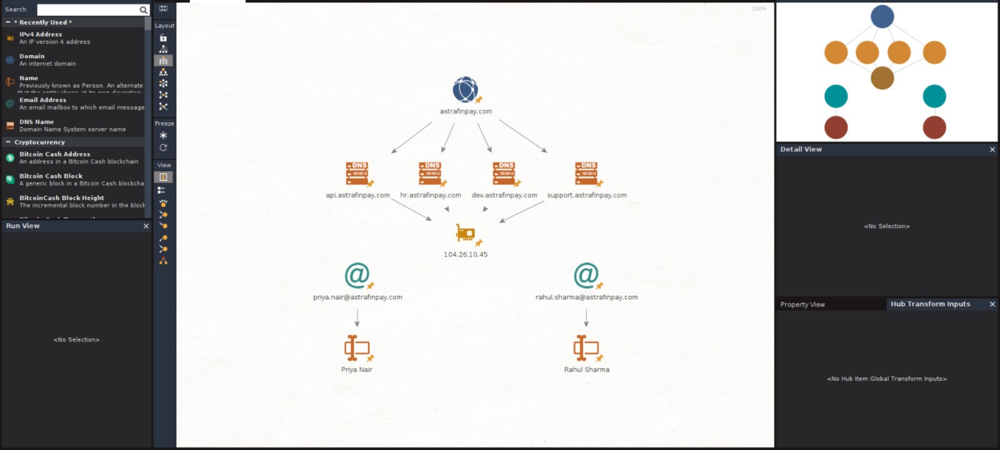

# 🔍 OSINT Security Assessment

## 📌 Overview
This project demonstrates how Open-Source Intelligence (OSINT) techniques can be used to analyze the digital footprint of an organization and identify potential security risks.

A simulated FinTech company, AstraFin Digital Payments Pvt Ltd, is used as the target for this investigation.

---

## 🎯 Objectives
- Perform OSINT-based investigation
- Identify publicly exposed information
- Map digital infrastructure
- Analyze potential risks

---

## 🛠️ Tool Used
- Maltego (For relationship mapping)

---

## ⚙️ Methodology
1. Target Definition
2. Data Collection
3. Relationship Mapping
4. Exposure Analysis
5. Risk Assessment

---

## 📊 Sample Investigation Graph



---

## 📂 Project Structure
- docs/ → Documentation
- simulated_data/ → Generated data
- assets/ → Screenshots
- scripts/ → Automation tools (email generator and risk assessment)  

---

## ✨ New Features

- Interactive Email Generator  
  - Generates employee email addresses based on user input  
  - Includes input validation and formatting  

- Interactive Risk Scoring System  
  - Evaluates OSINT exposure through user input  
  - Calculates overall risk score and level dynamically  

---

## 🚀 How to Run

### 📨 Email Generator
```bash
python scripts/email_generator.py
```

### 📈 Risk Assessment Tool
```bash
python scripts/risk_score.py
```
